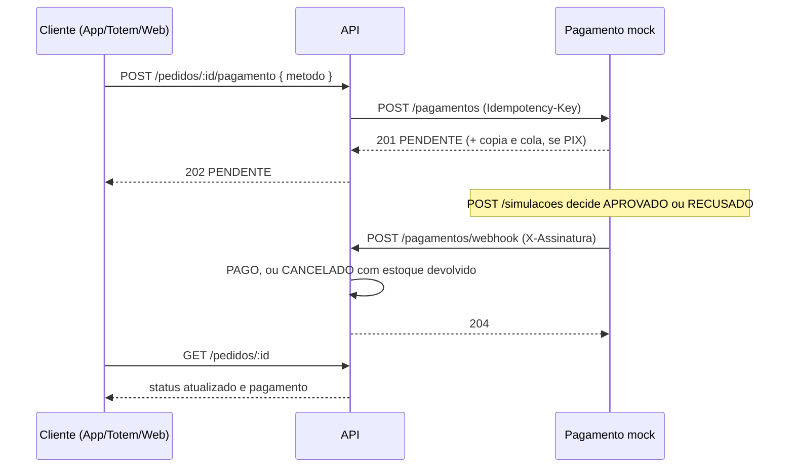

# API Raízes do Nordeste

API REST da rede de lanchonetes Raízes do Nordeste, construída com AdonisJS 7, PostgreSQL e Lucid ORM.

Projeto Multidisciplinar 2026, trilha Back-End (UNINTER).

## Estrutura do repositório

| Pasta | O que é |
|---|---|
| `api/` | A API REST, em AdonisJS |
| `pagamento-mock/` | Provedor de pagamento simulado, serviço separado em Fastify (veja o [README dele](pagamento-mock/README.md), que explica a escolha) |

## Execução com Docker

Com Docker e Docker Compose instalados, um comando sobe o PostgreSQL, o pagamento mock e a API, já com as migrations aplicadas e os dados de demonstração:

```bash
docker compose up --build
```

| Serviço | URL |
|---|---|
| API e Swagger | http://localhost:3333/docs |
| Pagamento mock | http://localhost:4000/openapi.yaml |
| PostgreSQL | `127.0.0.1:5433`, usuário e senha `postgres` |

As variáveis do `docker-compose.yml` são de demonstração local, inclusive o `APP_KEY` e o segredo do webhook. Para desenvolver com recarga automática, rode as aplicações direto no host, como descrito abaixo.

A API e o pagamento mock são processos separados, cada um no seu container, e só conversam por HTTP: a API chama `http://pagamento-mock:4000` e o mock devolve o resultado em `http://api:3333/api/v1/pagamentos/webhook`. O código entra na imagem no build, então depois de mudar o código é preciso o `--build`; sem ele, o `docker compose up` reaproveita as imagens já construídas.

## Requisitos para rodar no host

- Node.js 24 ou superior
- npm 11 ou superior
- PostgreSQL 14 ou superior, acessível localmente

## Como executar

A API vive em `api/`, e os comandos a seguir rodam a partir dessa pasta, exceto onde indicado.

```bash
cd api
npm install
cp .env.example .env
```

Abra o `.env` e ajuste as variáveis de banco para o seu PostgreSQL. Os valores padrão assumem um servidor local em `127.0.0.1:5432` com o usuário `postgres`.

| Variável | Para que serve | Padrão |
|---|---|---|
| `PORT` | Porta em que a API escuta | `3333` |
| `APP_KEY` | Chave de criptografia da aplicação | gerada na instalação |
| `DB_HOST` | Host do PostgreSQL | `127.0.0.1` |
| `DB_PORT` | Porta do PostgreSQL | `5432` |
| `DB_USER` | Usuário do banco | `postgres` |
| `DB_PASSWORD` | Senha do banco | vazio |
| `DB_DATABASE` | Nome do banco | `raizes_nordeste` |
| `PAGAMENTO_GATEWAY_URL` | Endereço do pagamento mock | `http://localhost:4000` |
| `PAGAMENTO_WEBHOOK_SECRET` | Segredo da assinatura do webhook, o mesmo do mock | `troque-este-segredo` |

Crie os bancos de desenvolvimento e de testes:

```bash
createdb -h 127.0.0.1 -U postgres raizes_nordeste
createdb -h 127.0.0.1 -U postgres raizes_nordeste_test
```

Rode as migrations, popule os dados de demonstração e suba a API:

```bash
node ace migration:run
node ace db:seed
npm run dev
```

A API sobe na URL impressa na inicialização, em geral `http://localhost:3333`. Se a porta do `.env` estiver ocupada, o Adonis escolhe outra, então use sempre a URL do console. Nesse caso, ajuste também o `WEBHOOK_URL` do mock, ou o resultado do pagamento não chega.

### Pagamento mock no host

O pagamento só se completa com o mock no ar. Em outro terminal, a partir da raiz do repositório:

```bash
cd pagamento-mock
npm install
cp .env.example .env
npm run dev
```

Os padrões dos dois `.env.example` já combinam: a API chama o mock em `localhost:4000`, o mock entrega o webhook em `localhost:3333` e os dois usam o mesmo segredo. Se mudar o segredo de um lado, mude do outro, ou o webhook responde `401 ASSINATURA_INVALIDA`.

### Mock no Docker, API no host

Também dá para subir só o mock em container e manter a API no host. Duas coisas mudam em relação ao Compose completo:

- dentro do container, `api:3333` não existe e `localhost` é o próprio container, então o webhook precisa apontar para `host.docker.internal`, e o segredo precisa ser o mesmo do `api/.env`;
- a API precisa escutar em todas as interfaces (`HOST=0.0.0.0`), porque o `HOST=localhost` do `.env` só aceita conexões do próprio host, e o container chega por outra interface.

```bash
PAGAMENTO_WEBHOOK_URL=http://host.docker.internal:3333/api/v1/pagamentos/webhook \
PAGAMENTO_WEBHOOK_SECRET=troque-este-segredo \
docker compose up pagamento-mock

cd api && HOST=0.0.0.0 npm run dev
```

### Dados de demonstração

O seeder cria quatro unidades (uma delas inativa, de propósito), oito produtos, o cardápio e o estoque de cada unidade, e um usuário para cada perfil. Rodá-lo mais de uma vez não duplica nada. Todas as contas usam a senha `Senha@123`:

| E-mail | Perfil |
|---|---|
| `admin@raizes.test` | ADMIN |
| `gerente@raizes.test` | GERENTE |
| `atendente@raizes.test` | ATENDENTE |
| `cozinha@raizes.test` | COZINHA |
| `cliente@raizes.test` | CLIENTE |

## Documentação da API

Com o servidor rodando, abra `/docs` na URL impressa na inicialização. A raiz `/` redireciona para lá.

O contrato fica em [`api/openapi.yaml`](api/openapi.yaml) e é servido em `/docs/openapi.yaml`. O Swagger UI é servido a partir do pacote instalado localmente, sem depender de CDN, então a documentação funciona offline.

O documento é escrito à mão, e não gerado por biblioteca. Em troca disso, um teste automatizado compara os caminhos declarados no `openapi.yaml` com as rotas realmente registradas no router e falha se as duas listas divergirem, de modo que o contrato não envelhece em silêncio.

## Endpoints

O Swagger em `/docs` traz os exemplos de request e response de cada um. Esta tabela é só um mapa rápido.

| Método | Rota | Auth | O que faz |
|---:|:---|:---|:---|
| GET | `/` | pública | Redireciona para a documentação |
| GET | `/docs` | pública | Swagger UI |
| POST | `/api/v1/auth/signup` | pública | Cria conta e devolve token |
| POST | `/api/v1/auth/login` | pública | Autentica e devolve token |
| GET | `/api/v1/account/profile` | token | Dados da conta autenticada |
| POST | `/api/v1/account/logout` | token | Revoga o token em uso |
| GET | `/api/v1/unidades` | pública | Lista unidades, com filtros e paginação |
| GET | `/api/v1/unidades/:id` | pública | Detalhe de uma unidade |
| GET | `/api/v1/unidades/:id/cardapio` | pública | Cardápio da unidade, com preço e disponibilidade |
| GET | `/api/v1/unidades/:id/estoque` | token, perfis da operação | Saldo de estoque da unidade, produto a produto |
| POST | `/api/v1/pedidos` | token, perfil CLIENTE | Cria o pedido validando cardápio e estoque da unidade |
| GET | `/api/v1/pedidos/:id` | token, perfil CLIENTE, dono do pedido | Pedido com itens e pagamento |
| POST | `/api/v1/pedidos/:id/pagamento` | token, perfil CLIENTE, dono do pedido | Solicita o pagamento ao provedor externo |
| POST | `/api/v1/pagamentos/webhook` | assinatura HMAC do provedor | Recebe o resultado do pagamento |

Listagens aceitam `?page=1&limit=10` e respondem `{ "data": [...], "metadata": { ... } }`.

Consultar unidades e cardápio é público de propósito: na jornada do caso, o cliente vê o cardápio da unidade antes de se identificar.

## Autorização por perfil

Cada usuário tem um perfil (`CLIENTE`, `ATENDENTE`, `COZINHA`, `GERENTE`, `ADMIN`), e o middleware nomeado `perfil` restringe a rota aos perfis que ela aceita:

```ts
router
  .get(':id/estoque', [controllers.Estoques, 'index'])
  .use(middleware.perfil({ perfis: PERFIS_DA_OPERACAO }))
```

Sem token, a resposta é `401 NAO_AUTENTICADO`. Com token de um perfil que a rota não aceita, é `403 SEM_PERMISSAO`, no mesmo corpo padronizado de qualquer outra falha. O perfil é conferido antes de o controller rodar, então um perfil sem permissão não descobre nem se o recurso existe.

O saldo de estoque fica restrito a quem opera a unidade porque o que interessa ao cliente, se o produto está disponível, ele já vê no cardápio público, sem saber quantas unidades restam.

Nas rotas de um pedido existente (`GET /pedidos/:id` e `POST /pedidos/:id/pagamento`), além do perfil, a API confere a posse: o pedido precisa ser do cliente do token, ou a resposta é `403 SEM_PERMISSAO` com a mensagem "Este pedido pertence a outro cliente.". A ordem é perfil, existência (`404`) e posse (`403`).

No estoque, a autorização ainda é só por perfil: hoje um gerente consegue consultar o estoque de qualquer unidade, não só da sua. Restringir o acesso à unidade do próprio vínculo (`users.unidade_id`) é o passo seguinte, e não está implementado.

## Criação de pedido

`POST /api/v1/pedidos` é o começo do fluxo crítico: cria o pedido em `AGUARDANDO_PAGAMENTO`, à espera do [pagamento](#pagamento).

```json
{
  "unidadeId": 1,
  "canalPedido": "TOTEM",
  "itens": [{ "produtoId": 1, "quantidade": 2 }]
}
```

- **O cliente vem do token.** O corpo não aceita `clienteId`, então ninguém cria pedido em nome de outra pessoa, e a resposta não expõe dado pessoal.
- **O servidor calcula o preço.** Cada item copia o nome e o preço praticado na unidade naquele momento, e o total é somado em centavos inteiros, sem erro de ponto flutuante.
- **O estoque é baixado na criação**, com uma movimentação de `SAIDA` por item, vinculada ao pedido. Baixar só na aprovação do pagamento deixaria a checagem da criação como mera sugestão: dois clientes poderiam pagar pela mesma última unidade, e o conflito apareceria depois do dinheiro, na forma de estorno. Com a baixa na criação, o 409 acontece antes de qualquer cobrança. A recusa do pagamento devolve o saldo com uma movimentação de `ENTRADA`.
- **Pedidos simultâneos não vendem a mesma unidade duas vezes.** Tudo roda numa transação, e os saldos dos produtos do pedido são bloqueados com `SELECT ... FOR UPDATE`, sempre na ordem do `produto_id` para evitar deadlock. Um segundo pedido pelo mesmo produto espera o primeiro terminar e enxerga o saldo já baixado. Há um teste que dispara dois pedidos ao mesmo tempo pela última unidade e exige um `201` e um `409`; sem o bloqueio, os dois são aceitos.

As verificações seguem uma ordem fixa, e cada uma aponta em `details` todos os itens com problema, não só o primeiro:

| Situação | Status | `error` |
|---|---|---|
| `canalPedido` ausente ou fora da lista, itens vazios ou repetidos | 422 | `DADOS_INVALIDOS` |
| Unidade inexistente | 404 | `UNIDADE_NAO_ENCONTRADA` |
| Unidade inativa | 409 | `UNIDADE_INATIVA` |
| Produto fora do cardápio da unidade | 404 | `PRODUTO_NAO_ENCONTRADO` |
| Produto marcado indisponível na unidade ou inativo na rede | 409 | `PRODUTO_INDISPONIVEL` |
| Quantidade acima do saldo | 409 | `ESTOQUE_INSUFICIENTE` |

Limitação conhecida: um pedido que nunca é pago segura o estoque indefinidamente. Liberar a reserva de pedidos abandonados exige expiração por tempo, com uma rotina agendada que cancele o pedido e devolva o saldo, e isso não está implementado.

## Pagamento

O pagamento fecha o fluxo crítico (pedido, pagamento externo, atualização de status). A rede não processa pagamento: como pede o caso, a API **solicita** o pagamento a um provedor externo, **recebe** a confirmação ou a negativa, **registra** o resultado e **atualiza** o status do pedido. O provedor é simulado pelo serviço [`pagamento-mock/`](pagamento-mock/README.md), que roda em processo separado, como rodaria um gateway de verdade.



### Como demonstrar

Com a pilha no ar (`docker compose up --build`):

1. Faça login com `cliente@raizes.test` e crie um pedido em `POST /api/v1/pedidos`.
2. Peça o pagamento em `POST /api/v1/pedidos/{id}/pagamento` com `{ "metodo": "PIX" }`. A resposta é `202` com o pagamento `PENDENTE` e a `referenciaExterna`, o identificador no provedor.
3. Decida o resultado no mock: `POST http://localhost:4000/simulacoes` com `{ "pagamentoId": "<referenciaExterna>", "resultado": "APROVADO" }` (ou `"RECUSADO"`, com `motivo` opcional). É o papel do cliente pagando no app do banco, ou do emissor recusando.
4. Consulte `GET /api/v1/pedidos/{id}`: aprovado deixa o pedido `PAGO`; recusado deixa o pedido `CANCELADO`, o pagamento `RECUSADO` com o motivo, e o estoque de volta ao saldo anterior.

### Decisões

- **Assíncrono, como num provedor real.** A solicitação responde `202` e o resultado chega depois, por webhook. PIX, um dos métodos aceitos, é assíncrono por natureza: o cliente paga no app do banco e o provedor avisa. O `202` informa o que se sabe naquele momento, e o cliente acompanha o desfecho pelo `GET /pedidos/:id`.
- **Recusa cancela o pedido e devolve o estoque.** O pedido vai para `CANCELADO`, o pagamento para `RECUSADO` com o motivo, e cada item volta ao saldo com uma movimentação de `ENTRADA` vinculada ao pedido, tudo numa transação. Manter o pedido aberto para nova tentativa obrigaria a reservar o estoque de novo no meio do pagamento, ou a segurá-lo indefinidamente; para tentar outra vez, o cliente cria um novo pedido.
- **O registro guarda o envio e o retorno.** `pagamentos.payload_requisicao` tem o que foi enviado ao provedor, `payload_resposta` a resposta da solicitação e `payload_webhook` o evento com o resultado, além de `referencia_externa` e `processado_em`. O envio não leva dado pessoal do cliente, só a referência, o valor em centavos, o método e o código do pedido.
- **Sem dados de cartão.** A captura do cartão é responsabilidade do app cliente junto ao provedor, como fazem os gateways reais. A API recebe só o método, e nem ela nem o mock veem número de cartão, o que tira a API do escopo mais pesado de conformidade de cartões e reduz o que há a proteger sob a LGPD.
- **`DINHEIRO` fica fora desta rota.** Dinheiro não passa por provedor externo; é confirmado no balcão pelo atendente, fluxo que ainda não está implementado. A rota aceita `PIX`, `CARTAO_CREDITO` e `CARTAO_DEBITO`.
- **Rota aninhada no pedido.** O §6.1 do roteiro organiza `/pagamentos` como recurso de simulação e confirmação. Aqui a solicitação fica em `/pedidos/:id/pagamento`, porque o pagamento pertence ao pedido e a existência, a posse e o status são todos checados nele; a confirmação é `/pagamentos/webhook`.

### Idempotência

O provedor entrega cada evento ao menos uma vez, e o cliente pode repetir a solicitação depois de um timeout. Nenhum dos dois casos cobra ou devolve estoque duas vezes:

- **Solicitação idempotente por pedido.** O pedido fica bloqueado (`SELECT ... FOR UPDATE`) durante a checagem, e um pedido tem no máximo um pagamento (`pagamentos.pedido_id` é único). Repetir a chamada com o mesmo método devolve o mesmo pagamento; com outro método, é `409 PAGAMENTO_EM_ANDAMENTO`.
- **Chave de idempotência no provedor.** A API envia `Idempotency-Key: pagamento-<id>`. Se o provedor não respondeu, a nova tentativa reusa a mesma chave, e o provedor devolve o pagamento original em vez de criar outro.
- **Webhook idempotente.** O pedido e o pagamento ficam bloqueados durante o processamento, e um resultado para um pagamento que já não está `PENDENTE` é ignorado com `204`. O mock entrega cada evento duas vezes de propósito (`WEBHOOK_DELIVERIES=2`), para exercitar isso.

Há testes que disparam solicitações e entregas simultâneas enquanto o pedido está bloqueado e exigem um único pagamento e uma única devolução de estoque; sem os bloqueios, eles falham.

### Falhas do provedor

A chamada ao provedor fica fora de qualquer transação, para não segurar bloqueios do banco enquanto espera a rede. Falhas transitórias (rede, timeout, status 5xx) são retentadas com espera exponencial e a mesma chave. Esgotadas as tentativas, a resposta é `503 GATEWAY_PAGAMENTO_INDISPONIVEL`, o pagamento fica `PENDENTE` sem referência externa, e repetir a chamada retoma de onde parou. Uma resposta fora do contrato, validada com VineJS, vira `502 GATEWAY_PAGAMENTO_ERRO`. O mock simula indisponibilidade com `FAILURE_RATE`.

### Segurança do webhook

O webhook não usa token: quem chama é o provedor. A autenticidade vem do cabeçalho `X-Assinatura: t=<unix>,v1=<hmac>`, um HMAC-SHA256 de `<t>.<corpo bruto>` com o segredo compartilhado `PAGAMENTO_WEBHOOK_SECRET`, comparado em tempo constante. Assinatura ausente, inválida ou com mais de 5 minutos responde `401 ASSINATURA_INVALIDA`, o que barra tanto um corpo adulterado quanto a repetição de uma entrega capturada. Além disso, o valor e o identificador do provedor são conferidos com o pagamento registrado (`409 PAGAMENTO_DIVERGENTE`).

### Limitações conhecidas

- O mock guarda o estado em memória. Se ele reiniciar com pagamentos pendentes, esses pagamentos não recebem mais resultado.
- Se o provedor esgotar as tentativas de entrega do webhook, o pagamento fica `PENDENTE`. O mock já expõe `GET /pagamentos/:id`, e uma rotina de conciliação que consulte os pendentes antigos é o passo seguinte, ainda não implementado.
- Um pagamento pendente segura o estoque do pedido pelo tempo que durar, pela mesma razão descrita na criação de pedido.

## Padrão de erro

Toda falha, em qualquer endpoint, responde com o mesmo corpo:

```json
{
  "error": "ESTOQUE_INSUFICIENTE",
  "message": "Nao ha quantidade suficiente para um ou mais itens.",
  "details": [{ "field": "itens[0].quantidade", "issue": "Disponivel: 1" }],
  "timestamp": "2026-02-05T12:00:00.000Z",
  "path": "/api/v1/pedidos",
  "requestId": "33be9a44-6849-439c-960c-cb2d995aa732"
}
```

O campo `error` é um identificador estável, pensado para o cliente tratar programaticamente; `message` é a mensagem legível; `details` traz um item por campo reprovado e vem vazio quando o erro não é de validação.

## Comandos

A partir de `api/`:

```bash
npm run dev         # servidor de desenvolvimento com recarga automática
npm start           # servidor de produção, a partir do build
npm run build       # compila para build/
npm test            # suíte de testes
npm run lint        # ESLint
npm run typecheck   # TypeScript sem emitir arquivos
npm run format      # Prettier

node ace migration:run      # aplica as migrations pendentes
node ace migration:fresh    # recria o banco do zero
node ace db:seed            # popula os dados de demonstração
node ace list:routes        # lista as rotas registradas
node ace codegen            # regenera os tipos de rotas e controllers
```

Os testes usam o banco `raizes_nordeste_test`, definido em `.env.test`. As migrations rodam e são revertidas automaticamente a cada execução, e cada teste começa com as tabelas limpas.

## Organização do projeto

Dentro de `api/`:

```
app/
  controllers/   entrada HTTP, uma classe por recurso
  exceptions/    ApiException e o handler que padroniza as falhas
  middleware/    autenticação, perfil e assinatura do webhook
  models/        entidades do domínio, relações e regras próprias
  services/      casos de uso que orquestram mais de um model
  transformers/  o que cada resposta expõe
  validators/    schemas VineJS de entrada
config/          configuração do framework e do pagamento
providers/       registro do gateway de pagamento no container
database/
  migrations/    evolução do esquema, fonte da verdade
  schema.ts      classes geradas pelo Lucid a partir do banco
  schema_rules.ts  tipagem das colunas enum no arquivo gerado
start/           rotas, kernel HTTP e variáveis de ambiente
tests/
  functional/    testes que sobem o servidor HTTP
  unit/          regras de domínio isoladas
```

As camadas seguem a separação pedida no roteiro: o **domínio** vive em `app/models`, a **infraestrutura** em `database/` e `config/`, e a **API** em `app/controllers`, `app/validators`, `app/transformers` e `start/routes.ts`. A camada de **aplicação**, com os casos de uso que orquestram o fluxo do pedido, vive em `app/services`.

### Schema gerado

No AdonisJS 7 as migrations são a fonte da verdade do esquema. Depois de `node ace migration:run`, o Lucid lê o banco e regenera `database/schema.ts` com as classes de coluna tipadas. Esse arquivo não deve ser editado à mão. Os models estendem essas classes e ficam só com relações e regras de negócio.

Colunas de valores fechados são declaradas como `string` na migration. A lista válida vive no model que a possui, como uma `const` marcada `as const`, e `database/schema_rules.ts` aponta a coluna para o tipo derivado dela. Assim `pedido.canalPedido` é `CanalPedido` no TypeScript, e não `string`, sem que o esquema precise de migration a cada valor novo.

## Modelo de dados

| Tabela | Papel |
|---|---|
| `users` | Clientes e equipe, com perfil e marcos de consentimento LGPD |
| `unidades` | Unidades da rede, com formato de operação |
| `produtos` | Catálogo da rede |
| `unidade_produtos` | Cardápio por unidade, com preço local |
| `estoques` | Saldo por unidade e produto |
| `movimentacoes_estoque` | Histórico de entrada, saída e ajuste |
| `pedidos` | Pedido com canal de origem, status e totais |
| `pedido_itens` | Itens do pedido, com preço no momento da compra |
| `pagamentos` | Solicitação e retorno do pagamento externo simulado |
| `fidelidade_contas` | Saldo de pontos por cliente |
| `fidelidade_movimentos` | Acúmulo, resgate, expiração e estorno de pontos |
| `promocoes` | Campanhas por rede, unidade ou canal |
| `logs_auditoria` | Registro de ações sensíveis |

Decisões que valem destaque:

- **O canal é dado de domínio.** `pedidos.canal_pedido` é obrigatório e aceita `APP`, `TOTEM`, `BALCAO`, `PICKUP` e `WEB`. A lista vive em `CANAIS_PEDIDO`, no model `Pedido`, e é dali que saem tanto o tipo TypeScript da coluna quanto a validação de entrada.
- **Preço é copiado para o item do pedido.** `pedido_itens.preco_unitario` e `nome_produto` guardam o valor no momento da compra, para que uma alteração de cardápio não reescreva o histórico de vendas.
- **Unidades são heterogêneas.** O cardápio e o estoque são por unidade, então duas unidades podem ofertar produtos diferentes e a preços diferentes sem quebrar o padrão da rede.
- **Pagamento é desacoplado.** A tabela `pagamentos` guarda os payloads de ida e volta do provedor externo, o que permite auditar a negociação inteira sem que o sistema processe pagamento.
- **Invariantes numéricas no banco.** Estoque não fica negativo, item de pedido exige quantidade positiva, saldo de fidelidade não fica negativo e uma unidade não repete o mesmo produto no cardápio ou no estoque.

